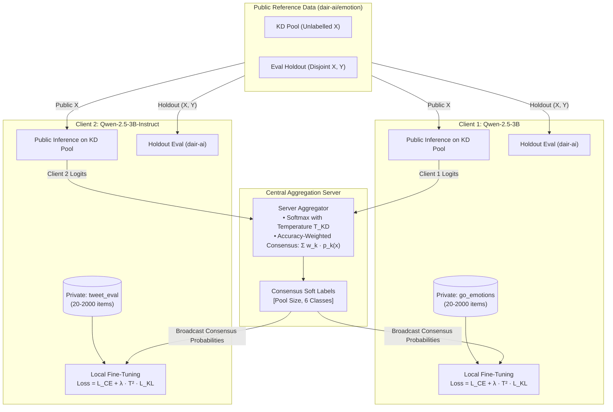
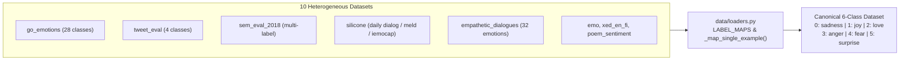
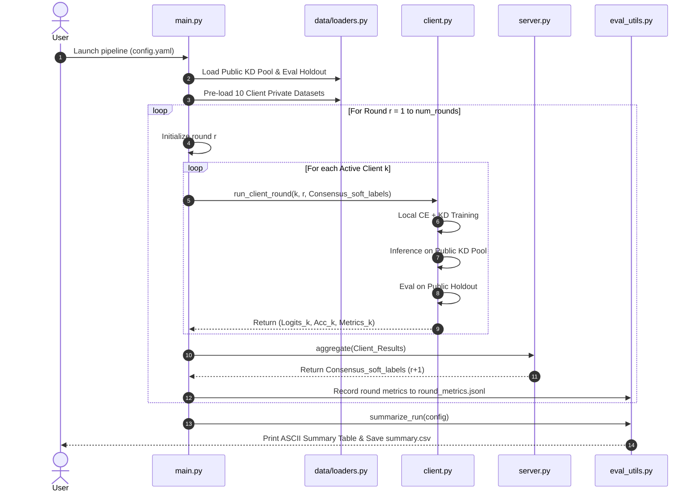

# Comprehensive Architecture & Code Report
## Heterogeneous Federated Knowledge Distillation for Emotion Classification (`federated_emotion`)

---

### Executive Summary

This report provides an exhaustive, line-by-line and section-by-section breakdown of the **Federated Emotion Distillation** pipeline (`federated_emotion/`). 

In conventional Federated Learning (e.g., **FedAvg**), participating clients must share identical model architectures because the central server averages model parameters ($\theta_{\text{global}} = \sum w_k \theta_k$). In this project, however, **clients possess entirely distinct neural architectures** (e.g., Qwen-2.5-3B, LLaMA-3.2-3B, Phi-3.5-mini, StableLM-3B, OpenELM-3B, etc.) with different hidden layer dimensions, parameter counts, and vocabularies. Parameter averaging is mathematically impossible across such models.

To overcome model heterogeneity while preserving data privacy, this codebase implements **Federated Knowledge Distillation (Fed-KD)** via an unlabelled public reference pool. Instead of communicating weights or gradients, clients communicate output probability distributions (soft labels) over a shared public dataset (`dair-ai/emotion`). The central server aggregates these soft distributions into a consensus teacher distribution, which is then broadcast back to clients to guide local fine-tuning via **Kullback-Leibler (KL) divergence distillation loss** alongside private task-specific **Cross-Entropy loss**.



---

## 1. Mathematical Formulation & Training Objectives

### 1.1. Local Optimization Objective
For a given client $k$ during communication round $r$, training proceeds over local private batches $\mathcal{B}_{\text{priv}} = \{(x_i, y_i)\}$ and interleaved public transfer batches $\mathcal{B}_{\text{kd}} = \{(x_j, \text{idx}_j)\}$.

1. **Supervised Private Cross-Entropy Loss**:
   $$\mathcal{L}_{\text{CE}}(\theta_k; \mathcal{B}_{\text{priv}}) = -\frac{1}{|\mathcal{B}_{\text{priv}}|} \sum_{(x_i, y_i) \in \mathcal{B}_{\text{priv}}} \log \sigma(z_k(x_i))_{y_i}$$
   where $z_k(x)$ denotes the 6-dimensional unnormalized logit output of model $k$, and $\sigma(\cdot)$ is the standard softmax function.

2. **Knowledge Distillation (KD) Loss**:
   When round $r > r_{\text{warmup}}$ and consensus teacher probabilities $p_{\text{consensus}}$ are available from the server:
   $$\mathcal{L}_{\text{KD}}(\theta_k; \mathcal{B}_{\text{kd}}) = T^2 \cdot \frac{1}{|\mathcal{B}_{\text{kd}}|} \sum_{x_j \in \mathcal{B}_{\text{kd}}} \mathcal{D}_{\text{KL}}\left(\sigma\left(\frac{z_k(x_j)}{T}\right) \,\Big\|\, p_{\text{consensus}}(x_j)\right)$$
   where:
   - $T = \text{kd\_temperature}$ scales the logits to soften probability distributions, revealing inter-class affinities.
   - $T^2$ is the standard Hinton distillation scaling factor ensuring the gradient magnitude matches that of hard cross-entropy.
   - $\mathcal{D}_{\text{KL}}(P \| Q) = \sum_{c=1}^C P(c) \log \left(\frac{P(c)}{Q(c)}\right)$. In PyTorch, `KLDivLoss(reduction="batchmean")` takes input log-probabilities and target probabilities.

3. **Composite Objective**:
   $$\mathcal{L}_{\text{total}}(\theta_k) = \mathcal{L}_{\text{CE}}(\theta_k) + \mathbb{I}(r > r_{\text{warmup}}) \cdot \lambda_{\text{KD}} \cdot \mathcal{L}_{\text{KD}}(\theta_k)$$
   where $\lambda_{\text{KD}} = \text{kd\_lambda}$.

---

### 1.2. Server Soft-Label Consensus Aggregation
At the end of round $r$, each client $k \in \{1, \dots, K\}$ submits its unnormalized logits over the public dataset: $Z_k \in \mathbb{R}^{N_{\text{kd}} \times 6}$.

1. **Temperature-Scaled Probability Matrix**:
   $$P_k(x_j, c) = \frac{\exp\left(Z_k(x_j, c) / T\right)}{\sum_{c'=1}^6 \exp\left(Z_k(x_j, c') / T\right)}$$

2. **Client Weighting ($w_k$)**:
   - **Uniform Mode** (`aggregation_mode: "uniform"`):
     $$w_k = \frac{1}{K}$$
   - **Accuracy-Weighted Mode** (`aggregation_mode: "accuracy_weighted"`):
     $$w_k = \frac{\exp\left(\text{Acc}_k / T_{\text{agg}}\right)}{\sum_{j=1}^K \exp\left(\text{Acc}_j / T_{\text{agg}}\right)}$$
     where $\text{Acc}_k$ is client $k$'s evaluation accuracy on the held-out evaluation set, and $T_{\text{agg}}$ controls the entropy of client weighting.

3. **Global Consensus Broadcast**:
   $$p_{\text{consensus}}(x_j) = \sum_{k=1}^K w_k P_k(x_j) \in \mathbb{R}^6 \quad \forall j \in \{1, \dots, N_{\text{kd}}\}$$
   This probability matrix $p_{\text{consensus}}$ of shape $(N_{\text{kd}}, 6)$ is broadcast to all clients for round $r + 1$.

---

## 2. Directory Layout & Module Responsibilities

```
federated_emotion/
├── config.yaml          # Global hyperparameters (10 clients, 10 rounds, LoRA r=8)
├── config_smoke.yaml    # Fast smoke test parameters (2 clients, 1 round, batch size 2)
├── config.py            # Typed dataclass, YAML deserializer, validation, env var resolution
├── requirements.txt     # Locked production dependencies
├── data/
│   ├── __init__.py      # Package export
│   └── loaders.py       # 6-class taxonomy, explicit label maps, public/private dataset loaders
├── models/
│   ├── __init__.py      # Package export
│   └── wrapper.py       # 10-model registry, FederatedClassifier (Backbone + LoRA + Head), VRAM cleaner
├── client.py            # Local training step, dual-batch loader, public inference & evaluation
├── server.py            # Probability conversion, weighting strategies, consensus aggregation
├── main.py              # Central orchestrator loop, checkpoint management, resume logic
└── eval_utils.py        # Metrics calculator (Acc, F1, KL div), summary table printer, CSV exporter
```

---

## 3. Detailed File-by-File Breakdown

### 3.1. `config.py` & `config.yaml`
**Purpose**: Centralize configuration management with strict typing and fail-fast validation.

- **`REQUIRED_CONFIG_FIELDS`**: A frozen `set` containing every mandatory configuration key. If any key is missing from `config.yaml`, a clear `ValueError` is raised immediately upon initialization.
- **`Config` (dataclass)**:
  - Strongly typed attributes (`num_clients: int`, `learning_rate: float`, `lora_rank: int`, `quant_bits: int`, etc.).
  - `@property def hf_token(self)`: Dynamically checks both environment variables (`$env:HF_TOKEN`) and raw token strings passed in YAML (`hf_...`), ensuring seamless authentication without manual script edits.
  - `get_seed_for_client(client_id)`: Implements deterministic seed formula: $\text{seed}_i = \text{seed\_base} + i$, guaranteeing reproducibility across distributed runs.
- **`load_config(path)`**: Handles file existence checks, parses YAML via `yaml.safe_load`, and instantiates `Config.from_dict()`.

---

### 3.2. `data/loaders.py`
**Purpose**: Ingest, harmonize, partition, and filter 10 heterogeneous emotion datasets into a uniform 6-class taxonomy.



1. **`CANONICAL_LABELS` (Taxonomy)**:
   - Index 0: `sadness`
   - Index 1: `joy`
   - Index 2: `love`
   - Index 3: `anger`
   - Index 4: `fear`
   - Index 5: `surprise`
   Matches the ground-truth distribution of the benchmark public dataset `dair-ai/emotion`.

2. **`LABEL_MAPS` (Harmonization Table)**:
   Contains explicit translation dictionaries for all 10 datasets:
   - `go_emotions`: Maps Ekman-adjacent classes (`anger`, `fear`, `joy`, `love`, `sadness`, `surprise`) to 0–5; maps peripheral emotions (`admiration`, `caring`, `curiosity`, `disgust`, `neutral`, etc.) to `None` (discarded).
   - `tweet_eval (emotion)`: Native classes (0: anger, 1: joy, 2: optimism, 3: sadness) $\to$ mapped to indices 3, 1, `None`, 0.
   - `sem_eval_2018_task1`: Evaluates multi-binary one-hot indicators; retains examples having exactly one positive canonical emotion.
   - `silicone` (`dyda_e`, `meld_e`, `iemocap`): Standardizes dialogue act/emotion strings to canonical integers.
   - `empathetic_dialogues`: Translates 32 fine-grained psychological categories to the 6 core dimensions.
   - `emo` (Turn-3 emotion): Maps 0: others, 1: happy, 2: sad, 3: angry $\to$ `None`, 1, 0, 3.
   - `xed_en_fi`: Multi-label Plutchik annotations $\to$ filters to single-label canonical matches.
   - `poem_sentiment`: 0: negative, 1: positive, 2: no_sentiment, 3: mixed $\to$ 0 (sadness), 1 (joy), `None`, `None`.

3. **`load_public_dataset(config)`**:
   - Downloads `dair-ai/emotion`.
   - Concatenates train, validation, and test splits into a unified candidate pool.
   - Shuffles deterministically using `config.seed_base`.
   - Partitions into two strictly disjoint subsets:
     - `kd_pool` ($N = \text{public\_kd\_pool\_size}$)
     - `eval_holdout` ($N = \text{public\_eval\_holdout\_size}$)

4. **`load_private_dataset(client_id, config)`**:
   - Maps `client_id` (1–10) to its assigned dataset via `CLIENT_DATASETS`.
   - Locates the text column dynamically via `_find_text_column` (`text`, `Tweet`, `utterance`, `sentence`, `content`).
   - Filters out rows that fail mapping or contain blank text.
   - Truncates dataset to `config.private_dataset_max_size` (preventing imbalance across clients with huge datasets like `go_emotions` vs small ones like `poem_sentiment`).

---

### 3.3. `models/wrapper.py`
**Purpose**: Encapsulate heterogeneous transformer backbones with parameter-efficient fine-tuning (PEFT LoRA), custom pooling, and classification heads.

1. **`CLIENT_MODELS` (Heterogeneous Model Registry)**:
   ```python
   1: "Qwen/Qwen2.5-3B",
   2: "Qwen/Qwen2.5-3B-Instruct",
   3: "meta-llama/Llama-3.2-3B",
   4: "meta-llama/Llama-3.2-3B-Instruct",
   5: "microsoft/Phi-3.5-mini-instruct",
   6: "stabilityai/stablelm-3b-4e1t",
   7: "openlm-research/open_llama_3b_v2",
   8: "togethercomputer/RedPajama-INCITE-3B-Base",
   9: "apple/OpenELM-3B",
   10: "Qwen/Qwen2.5-3B",
   ```

2. **`get_tokenizer(model_id, config)`**:
   - Loads the exact tokenizer matching each architecture.
   - **Special Handling for OpenELM**: OpenELM was released without a dedicated tokenizer repo. The function prioritizes open, ungated LLaMA tokenizers (`"huggyllama/llama-7b"`, `"openlm-research/open_llama_3b_v2"`) to avoid gating restrictions.
   - **Padding Token Alignment**: Standardizes `tokenizer.pad_token = tokenizer.eos_token` if absent, ensuring reliable batch collation.

3. **`FederatedClassifier(nn.Module)`**:
   - **Quantization Layer**: Configures `BitsAndBytesConfig` (4-bit NF4, double quantization, bfloat16 compute dtype). If running in environments where `bitsandbytes` CUDA kernels are unavailable, it catches the exception and falls back to native FP16/BF16 with `device_map="auto"`.
   - **LoRA Parameter-Efficient Adapter**:
     ```python
     LoraConfig(
         r=config.lora_rank,
         lora_alpha=config.lora_alpha,
         lora_dropout=config.lora_dropout,
         bias="none",
         task_type=TaskType.FEATURE_EXTRACTION,
         target_modules="all-linear",
     )
     ```
     Freezes the 3-billion-parameter backbone, leaving only ~0.2% of weights trainable (drastically speeding up training and reducing VRAM footprint).
   - **Attention-Mask-Weighted Mean Pooling**:
     Instead of arbitrary last-token pooling (which is brittle for non-causal tasks or padded batches), it extracts sequence representations by computing the attention-weighted average over valid tokens:
     $$h_{\text{pooled}} = \frac{\sum_{t=1}^L h_t \cdot m_t}{\sum_{t=1}^L m_t}$$
     where $m_t \in \{0, 1\}$ is the attention mask.
   - **Classification Head**:
     $$\text{Head}(h_{\text{pooled}}) = W \cdot h_{\text{pooled}} + b \quad \in \mathbb{R}^6$$
     Kept in full float32 precision for numerical stability during loss calculations.

4. **Adapter Checkpointing & Memory Freeing**:
   - `save_adapter(model, save_dir, meta_dict)`: Saves PEFT LoRA adapter weights (`adapter_model.safetensors`), head weights (`head.pt`), and client metadata (`meta.json`).
   - `load_adapter(model, load_dir)`: Restores LoRA weights and linear head from prior round checkpoints.
   - `free_model(model)`: Explicitly dereferences models, triggers Python garbage collection (`gc.collect()`), and purges PyTorch CUDA caching (`torch.cuda.empty_cache()`), preventing memory accumulation across sequential client turns.

---

### 3.4. `client.py`
**Purpose**: Orchestrate client-side training (CE + KD loss), KD pool inference, and holdout evaluation.

1. **Collation Function (`_create_collate_fn`)**:
   Converts raw text batches into padded tensor dictionaries (`input_ids`, `attention_mask`, `label`, `idx`) bounded by `max_seq_length`.

2. **Dual-Batch Training Pipeline**:
   - Builds `train_loader` over `private_dataset`.
   - Builds `kd_loader` over `public_kd_pool` (with indexed row IDs for aligned soft-label lookup).
   - Loops through `local_epochs`. In each step:
     1. Forward pass on private batch $\to \mathcal{L}_{\text{CE}}$.
     2. If KD is active: Forward pass on public batch $\to \mathcal{L}_{\text{KD}}$ using server consensus probabilities.
     3. Total loss $\mathcal{L}_{\text{total}} = \mathcal{L}_{\text{CE}} + \lambda \mathcal{L}_{\text{KD}}$ is backpropagated.
     4. Optimizer step updates LoRA + head weights.

3. **Inference & Evaluation**:
   - Switches model to `model.eval()`.
   - **Public KD Pool Inference**: Generates unnormalized logits $Z_k \in \mathbb{R}^{N_{\text{kd}} \times 6}$ under `torch.no_grad()`.
   - **Public Eval Holdout**: Evaluates accuracy and macro-F1 against the ground-truth held-out subset.
   - **Checkpoint Persistence**: Saves round adapter, head, and logits to `checkpoints/client_{id}/round_{r}/`.
   - Calls `free_model(model)` in a `finally:` block to guarantee VRAM deallocation even if an exception occurs.

---

### 3.5. `server.py`
**Purpose**: Server-side consensus aggregation of soft labels across heterogeneous clients.

1. **`aggregate(client_results, config)`**:
   - Filters out any failed or `None` client responses.
   - Validates that returned logit matrices match shape $(N_{\text{kd}}, 6)$.
   - Converts logits to softened probabilities:
     $$P_k = \text{softmax}\left(\frac{Z_k}{T_{\text{KD}}}\right)$$
   - Computes normalized weighting vector $\mathbf{w} \in \mathbb{R}^K$:
     - If `aggregation_mode == "uniform"`: $\mathbf{w} = [1/K, \dots, 1/K]$.
     - If `aggregation_mode == "accuracy_weighted"`: $\mathbf{w} = \text{softmax}(\mathbf{acc} / T_{\text{agg}})$.
   - Computes weighted linear combination:
     $$P_{\text{consensus}} = \sum_{k=1}^K w_k P_k$$
   - Emits logging table detailing client weights, accuracy metrics, and consensus entropy.

---

### 3.6. `main.py`
**Purpose**: End-to-end execution loop managing communication rounds, dataset preloading, checkpoint resumption, and metric aggregation.



1. **Phase 1: Dataset Ingestion**:
   Loads the public KD pool, eval holdout, and pre-caches all active private datasets once at startup to avoid repeated disk/network I/O across rounds.
2. **Phase 2: Round Orchestration Loop**:
   - Iterates through $r = 1 \dots \text{num\_rounds}$.
   - Manages resumption: If `--resume` is supplied, inspects `checkpoints/client_{k}/round_{r}/meta.json` and skips finished rounds.
   - Runs `run_client_round()` sequentially for each active client.
   - Passes collected client outputs to `server.aggregate()`.
   - Broadcasts updated $P_{\text{consensus}}$ to the next round.
3. **Phase 3: Final Run Summarization**:
   Invokes `eval_utils.summarize_run()` to output overall performance improvements.

---

### 3.7. `eval_utils.py`
**Purpose**: Performance tracking, metric computation, and tabular summary generation.

1. **`compute_metrics(predictions, targets)`**:
   Computes multiclass Accuracy, Macro F1, Weighted F1, and per-class precision/recall via `scikit-learn`.
2. **`compute_kl_divergence(student_logits, teacher_probs, temperature)`**:
   Calculates the empirical KL divergence between student predictions and consensus teacher distributions to verify knowledge transfer convergence over communication rounds.
3. **`MetricTracker`**:
   Appends structured JSON metrics per client per round to `logs/round_metrics.jsonl`.
4. **`summarize_run(config)`**:
   - Parses `logs/round_metrics.jsonl`.
   - Constructs a 2D matrix: Rows = Clients ($1 \dots 10$), Columns = Rounds ($1 \dots R$).
   - Calculates the group mean accuracy per round to quantify group-level federated gains.
   - Renders a clean ASCII table in stdout.
   - Exports `logs/summary.csv` for downstream graphing and analysis.

---

## 4. Key Architectural & Safety Design Decisions

| Design Decision | Implementation Rationale |
|---|---|
| **Knowledge Distillation over Parameter Averaging** | Heterogeneous backbones cannot average weights. Communicating logits over a public reference pool enables knowledge sharing without architectural constraints. |
| **Strict Data Privacy** | Client private datasets never leave local memory. Only unlabelled public dataset predictions are shared with the server. |
| **4-bit NF4 Quantization + LoRA** | Enables 3-billion-parameter LLMs to train locally in under 4GB of GPU VRAM. |
| **Ungated Tokenizer Fallbacks** | Prevents blocking on Hugging Face access gates for models like OpenELM. |
| **Attention-Mask-Weighted Mean Pooling** | Generates invariant fixed-size sentence embeddings regardless of padding length. |
| **Explicit Label Harmonization** | Guarantees all 10 heterogeneous datasets map unambiguously into the identical 6-class canonical emotion space. |
| **VRAM Purging (`free_model`)** | Forces garbage collection and CUDA cache clearing after every client round, preventing GPU memory leaks. |

---

## 5. Verification & Execution Commands

### Smoke Test (2 Clients, 1 Round)
```powershell
py -3.12 d:\Projects\BTP\FL\HeteroFed_with_KT\federated_emotion\main.py --config d:\Projects\BTP\FL\HeteroFed_with_KT\federated_emotion\config_smoke.yaml
```

### Full Federated Distillation (10 Clients, 10 Rounds)
```powershell
py -3.12 d:\Projects\BTP\FL\HeteroFed_with_KT\federated_emotion\main.py --config d:\Projects\BTP\FL\HeteroFed_with_KT\federated_emotion\config.yaml
```
